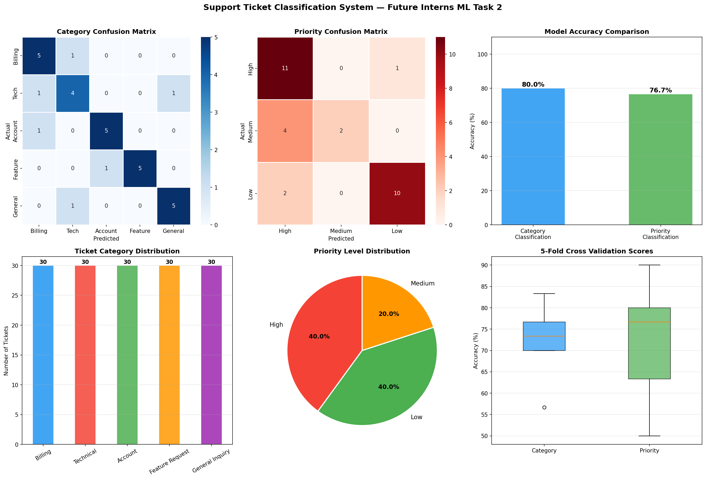

# 🎫 Support Ticket Classification System
### Future Interns — Machine Learning Internship | Task 2

---

## 📌 Project Overview
This project builds an ML system that automatically classifies
customer support tickets into categories and assigns priority
levels — helping support teams respond faster and smarter.

---

## 🗂️ Dataset
- **Total Tickets:** 150 support tickets
- **Categories:** 5 (Billing, Technical, Account, Feature Request, General Inquiry)
- **Priority Levels:** 3 (High, Medium, Low)
- **Distribution:** 30 tickets per category, perfectly balanced

---

## ⚙️ Methodology

### 1. Text Preprocessing
- Lowercasing and special character removal
- Stopword removal using NLTK
- Lemmatization using WordNetLemmatizer
- TF-IDF vectorization with n-grams (1,3)

### 2. Models Used
| Model | Purpose |
|-------|---------|
| Logistic Regression | Category Classification |
| Logistic Regression | Priority Classification |
| TF-IDF Vectorizer | Feature Extraction |

### 3. Pipeline
Raw Ticket → Preprocess → TF-IDF → Logistic Regression → Category + Priority

---

## 📊 Results

| Metric | Category | Priority |
|--------|----------|----------|
| Accuracy | 80.00% | 76.67% |
| F1 Score | 0.8023 | 0.7513 |
| Cross-Val (5-fold) | 72.00% | 72.00% |

---

## 🎯 Live Demo Results

| Ticket | Category | Priority | Confidence |
|--------|----------|----------|------------|
| Payment charged twice | 💳 Billing | 🔴 High | 79.1% |
| App keeps crashing | 🔧 Technical | 🔴 High | 51.3% |
| Change account password | 👤 Account | 🟡 Medium | 68.6% |
| Add dark mode please | 💡 Feature Request | 🟢 Low | 81.9% |
| What are support hours | ❓ General Inquiry | 🟢 Low | 74.6% |
| Server completely down | 🔧 Technical | 🔴 High | 71.0% |
| Update billing info | 👤 Account | 🟡 Medium | 72.2% |
| Better reporting features | 💡 Feature Request | 🟢 Low | 89.4% |
| Cannot login urgent | 🔧 Technical | 🔴 High | 81.5% |
| Add Google Drive integration | 💡 Feature Request | 🟢 Low | 86.6% |

---

## 📊 Business Impact

| Priority | Count | % | Response Time |
|----------|-------|---|---------------|
| 🔴 High | 60 | 40% | Within 1 hour |
| 🟡 Medium | 30 | 20% | Within 24 hours |
| 🟢 Low | 60 | 40% | Within 72 hours |

### 💡 Key Business Insights
- 60 high priority tickets need immediate attention
- System saves ~300 minutes of manual classification per 150 tickets
- Feature Requests and General Inquiries auto-routed to low priority queue

---

## 🛠️ Tools & Technologies

| Tool | Purpose |
|------|---------|
| Python 3.14 | Core programming language |
| NLTK | Text preprocessing and lemmatization |
| Scikit-learn | ML models and evaluation |
| TF-IDF Vectorizer | Feature extraction |
| Logistic Regression | Classification model |
| Pandas | Data manipulation |
| Matplotlib / Seaborn | Visualizations |
| Jupyter Notebook | Development environment |
| GitHub | Version control and submission |

---

## 📁 Repository Structure

- support_ticket_classification.ipynb — Main notebook with full pipeline
- ticket_classification.png — Visualization charts
- README.md — Project documentation

---

## 📉 Visualizations

---

## ✅ Internship Details
- **Organization:** Future Interns
- **Domain:** Machine Learning
- **Task:** 2 of 3
- **Track Code:** ML
- **Repository:** FUTURE_ML_02

---

*Submitted as part of the Future Interns Machine Learning Internship Program*
